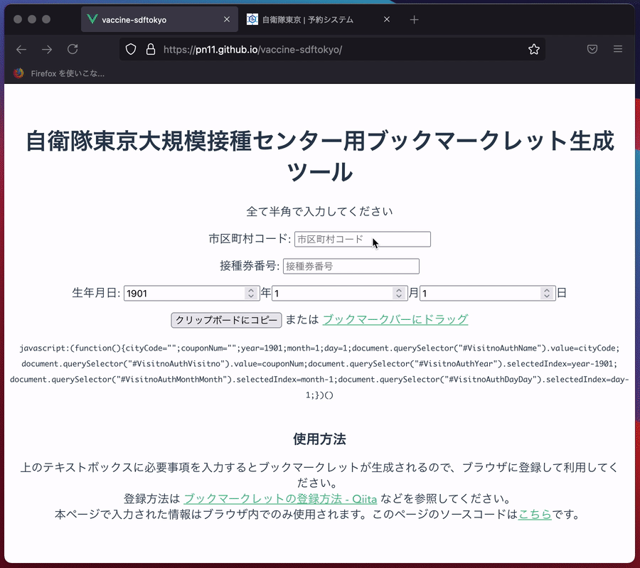

# vaccine-sdftokyo

- 公開ページ: <https://pn11.github.io/vaccine-sdftokyo/>
- GitHub Pages 用 ブランチ: <https://github.com/pn11/vaccine-sdftokyo/tree/gh-pages>
  - このブランチは [peaceiris/actions-gh-pages](https://github.com/peaceiris/actions-gh-pages) が作ったもの
- GitHub Actions: <https://github.com/pn11/vaccine-sdftokyo/blob/master/.github/workflows/deploy.yml>



## Project setup

```sh
npm install
```

### Compiles and hot-reloads for development

```sh
npm run serve
```

### Compiles and minifies for production

```sh
npm run build
```

### Lints and fixes files

```sh
npm run lint
```

### Customize configuration

See [Configuration Reference](https://cli.vuejs.org/config/).
